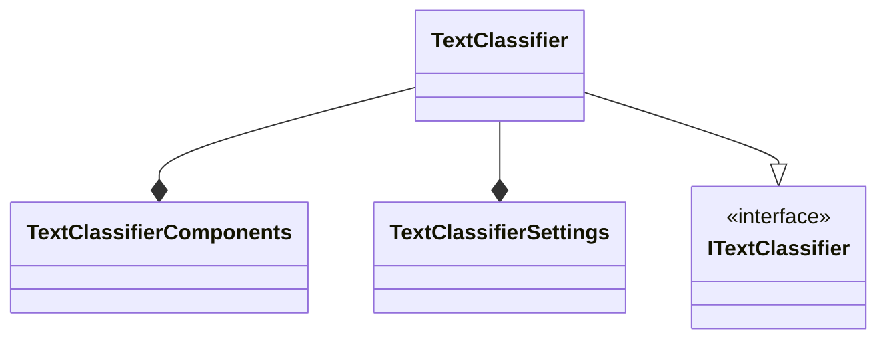

# Contribution Guide for C#
Contact: numbworks@gmail.com

## Revision History

| Date | Author | Description |
|---|---|---|
| 2023-05-20 | numbworks | Created. |

## Overview

This document is the `contribution guide` for all the C# code hosted on [github.com/numbworks](https://github.com/numbworks). 

## Disclaimer

I don't foresee to have external contribution to my codebases any time soon, but in the remote event I will, I think it's better to have a comprehensive `contribution guide` handy. 

Contributions are welcome, but please have in mind that I do use [github.com/numbworks](https://github.com/numbworks) as my personal portfolio and  that I do have a quite precise roadmap in my mind for each of my products.

## C#: Principles and Best Practices

Below a list of principles and best practice that are widely adopted in the codebase:

- `Maintainability First`: the highest cost in the software industry is the maintanance of a software over time, not its creation;
- `Software Usability` as part of the `definition-of-done`: usable software is pleasurable for the users to use and for the developer(s)to maintain;
- `Documentation` as part of the `definition-of-done`: every release should include up-to-date documentation, which makes the software easier to learn for the users and easier to debug for the developers; 
- `DRY Principle`: write a certain piece of code once, reference it millions of times;
- `Single Responsability Principle` (`SOLID`): every class should have one single responsability, even when you might end up having many very small classes;
- `Interface Segregation Principle` (`SOLID`): better to have a lot of smaller interfaces than a few bigger ones;
- `Dependency Inversion Principle` (`SOLID`): your code should always depend upon abstractions, not upon concrete classes.
- `Composition over inheritance`: objects have an opportunistic "has a" relationship with other objects that contain the piece of logic they require, instead of a parent-child relationship that could become difficult to mantain while the codebase expands;
- `Design Patterns`: you'll find a heavy use of `Factory Pattern`, `Repository Pattern` and `Object Mother Pattern` (for unit testing);
- software should have a high unit test coverage (> 70%) and make use testing best practices (consistent test naming convention - ex. BDD style, mocks, fakes, integration testing, ...);
- classes, variables and projects should be consistently named according to a pre-determined language domain and naming techniques that are well known to improve `code readibility` (hierachical naming, ...); 
- custom class and method `templates` are massively used within the whole codebase, in order to standardize the codebase and maximize the development speed;
- the use of external software packages should be reduced to the minimum, in order to avoid the extra work required to maintain their lifecycle over time;
- methods should have the minimum possible amount of arguments and, when possible, arguments should be aggregated in separate clases to improve methods `readibility` and `maintainability`;
- ...

## C#: Constructors and Properties

The `public properties` of a `class` should always be assignable exclusively thru the `constructor`, which means:

- centralizing validation logic (`DRY Principle`);
- removing all the possible hidden side effects of a distributed validation logic within the class;
- standardizing object creation and improving maintainability;
- getting additional performance and security benefits due of the `immutability` (thread safety, reference caching, ...).

```csharp
/* ... */

public uint TruncateTextInLogMessagesAfter { get; }
public double MinimumAccuracySingleLabel { get; }
public double MinimumAccuracyMultipleLabels { get; }
public string FolderPath { get; }

public TextClassifierSettings(
            uint truncateTextInLogMessagesAfter,
            double minimumAccuracySingleLabel,
            double minimumAccuracyMultipleLabels,
            string folderPath)
{

    Validator.ValidateStringNullOrWhiteSpace(folderPath, nameof(folderPath));

    TruncateTextInLogMessagesAfter = truncateTextInLogMessagesAfter;
    MinimumAccuracySingleLabel = minimumAccuracySingleLabel;
    MinimumAccuracyMultipleLabels = minimumAccuracyMultipleLabels;
    FolderPath = folderPath;

}

/* ... */
```

There could be some exceptions to the rule when dealing with DTOs (`Data Transfer Objects`) that don't require validation and/or that are for `internal` or `private` use only, but for which non-immutable `public properties` are required.

## C#: Default Constructors and Values

At the very least, classes embedding logic (no DTOs) should have two constructors:

- one that asks the consumer all the dependencies required by the class;
- a `default` one that initializes most or all of them by itself.

The use of a `default constructor` reduces to zero the amount of decisions and the number of "clicks" that a user or another developer should do to initialize your class, with a big positive impact on `software usability`.

```csharp
public class TextClassifierSettings
{

    public static uint DefaultTruncateTextInLogMessagesAfter { get; } = 20;
    public static double DefaultMinimumAccuracySingleLabel { get; } = 0.5;
    public static double DefaultMinimumAccuracyMultipleLabels { get; } = 0.0;
    public static string DefaultFolderPath { get; } = Directory.GetCurrentDirectory();

    public uint TruncateTextInLogMessagesAfter { get; }
    public double MinimumAccuracySingleLabel { get; }
    public double MinimumAccuracyMultipleLabels { get; }
    public string FolderPath { get; }

    /// <summary>Initializes a <see cref="TextClassifierSettings"/> instance.</summary>
    public TextClassifierSettings(
                uint truncateTextInLogMessagesAfter,
                double minimumAccuracySingleLabel,
                double minimumAccuracyMultipleLabels,
                string folderPath)
    {

        Validator.ValidateStringNullOrWhiteSpace(folderPath, nameof(folderPath));

        TruncateTextInLogMessagesAfter = truncateTextInLogMessagesAfter;
        MinimumAccuracySingleLabel = minimumAccuracySingleLabel;
        MinimumAccuracyMultipleLabels = minimumAccuracyMultipleLabels;
        FolderPath = folderPath;

    }

    /// <summary>Initializes a <see cref="TextClassifierSettings"/> instance using default parameters.</summary>
    public TextClassifierSettings()
        : this(
                truncateTextInLogMessagesAfter: DefaultTruncateTextInLogMessagesAfter,
                minimumAccuracySingleLabel: DefaultMinimumAccuracySingleLabel,
                minimumAccuracyMultipleLabels: DefaultMinimumAccuracyMultipleLabels,
                folderPath: DefaultFolderPath
                ) { }

    /* ... */

}
```

Additionally, each class should have the default values or delegates easily accessible thru `public` `static` properties. This approach will drastically improve the readability of the code and the testability of the class. 

Each `static` property that refers to a default value will be prefixed with the `Default` word.


## C#: Library Entry Point

Each library has a public `entry point` class, which conveniently collects and exposes all the available methods to the consumer. 

The `entry point` class summarizes how the consumer is allowed to interact with the library or, in other words, it exposes all the use cases that have been considered for the project so far.

To simplify its initialization, the `entry point` class doesn't exist without two other classes:

- a `settings` class, collecting all the settings that the library requires the user to provide in order to run
- a `components` class, collecting all the dependencies that the library requires in order to run

The diagram below summarize the architecture (`composition`):



Both classes are provided to the `entry point` class thru its constructor:

```csharp

/* ... */

/// <summary>Initializes a <see cref="TextClassifier"/> instance.</summary>
public TextClassifier(
    TextClassifierComponents components, 
    TextClassifierSettings settings)
{

    Validator.ValidateObject(components, nameof(components));
    Validator.ValidateObject(settings, nameof(settings));

    _components = components;
    _settings = settings;

    Version = Assembly.GetExecutingAssembly().GetName().Version.ToString();
    AsciiBanner = _components.AsciiBannerManager.Create(Version);

}

/// <summary>Initializes a <see cref="TextClassifier"/> instance using default parameters.</summary>
public TextClassifier()
    : this(
        DefaultTextClassifierComponents, 
        DefaultTextClassifierSettings) { }

/* ... */
```

## C#: Business Logic

Each class has two kinds of business logic: 

- `internal`, if provided by the class itself
- `external`, if provided by another class

Additionally, according to the `Single Responsability Principle`, every class should have one single responsability, therefore the non-specific logic should always be moved into its own separate class - for ex. all the serialization-related logic should be collected into the `Serializer` class (or in the `Serialization` namespace).

The `entry point` class is a good example of this, since most of the logic comes from its dependencies and the `entry point` class is only a "junction" between them and the library user.

```csharp
public class TextClassifier : ITextClassifier
{

    private TextClassifierComponents _components;

    /* ... */

    public void LogAsciiBanner()
        => _components.LoggingActionAsciiBanner(AsciiBanner);
    public IFileInfoAdapter Convert(string filePath)
        => _components.FileManager.Create(filePath);

    /* ... */
    
}
```

## C#: Private Methods

The use of `private` methods is absolutely incentivized: 

- they massively help to break the code in smaller parts within the same class, minimizing duplication and maximizing re-use
- they maximize the readibility of the `public` methods

A code example for the first scenario:

```csharp
/* ... */

public List<LabeledExample> LoadLabeledExamplesOrDefault(IFileInfoAdapter jsonFile)
    => LoadManyOrDefault<LabeledExample>(jsonFile);
public List<TextSnippet> LoadTextSnippetsOrDefault(IFileInfoAdapter jsonFile)
    => LoadManyOrDefault<TextSnippet>(jsonFile);
public NGramTokenizerRuleSet LoadTokenizerRuleSetOrDefault(IFileInfoAdapter jsonFile)
    => LoadOrDefault<NGramTokenizerRuleSet>(jsonFile);

/* ... */
```

A code example for the second scenario:

```csharp
/* ... */

public Session Explore(ushort finalPageNumber, Stages stage)
{

    Validator.ThrowIfLessThanOne(finalPageNumber, nameof(finalPageNumber));

    SessionData sessionData = CreateSessionData(finalPageNumber, stage, true);
    Session session = Explore(sessionData);

    return session;

}

/* ... */
```

## C#: The Session Object [TBD]

```csharp

```

## C#: The Components Object [TBD]

```csharp

```

## C#: The Settings Object [TBD]

```csharp

```

## Example Source Code

The code used in the example blocks comes from the following projects:

- [NW.NGramTextClassification](https://github.com/numbworks/NW.NGramTextClassification)
- [NW.WIDJobs](https://github.com/numbworks/NW.WIDJobs)

## Markdown Toolset

Suggested toolset to view and edit this Markdown file:

- [Visual Studio Code](https://code.visualstudio.com/)
- [Markdown Preview Enhanced](https://marketplace.visualstudio.com/items?itemName=shd101wyy.markdown-preview-enhanced)
- [Markdown PDF](https://marketplace.visualstudio.com/items?itemName=yzane.markdown-pdf)
